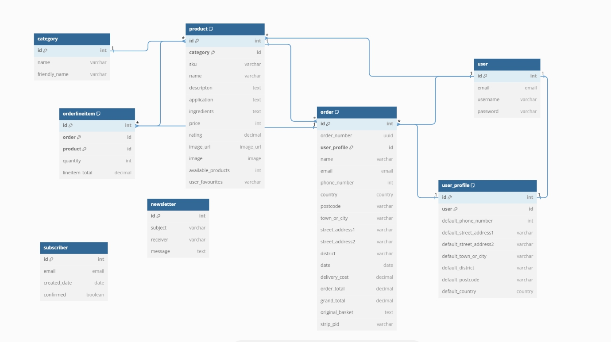
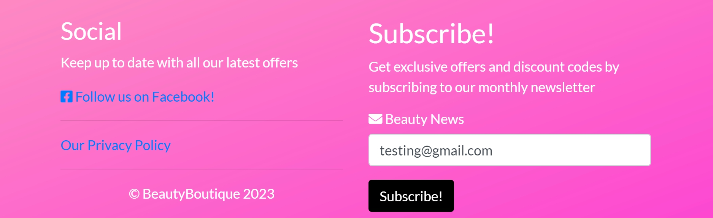

<h1 align = "center">THE CROWN EVENTS</h1><h3 align = "center">YOUR BEAUTY OUR PASSION</h3> 

## OVERVIEW

 

Beauty Boutique believe in the quality and commitment to develop good relationship with our customers. From drugstore and natural cosmetics to premium and luxury, the online shop covers all product segments. The categories perfume, skin care, make-up, hair care, beauty tools and accessories offer a diverse selection of products for individual and daily beauty routines.

To keep the customers upto date we also offer to subscribe to our Beauty News and receive Newsletters of all the updates.

Utilising the Django Full Stack Web Framework, Bootstrap, Stripe API for secure payments, and underwritten by the principles of User Experience design and Search Engine Optimisation, the Sensical.ie Webstore offers its customers an effortless, logical, and rewarding user experience.

Users can make online purchases either as a guest or logged in. Once payment is successful, the user is sent an email confirmation of their purchase and their order number.

### <h2 align = "center" target = "_blank"> [View The Live Project](https://beauty-boutique-0f4969a43fa4.herokuapp.com/)</h2>   

# Table of Contents
- [Planning and Design](#planning-and-design)

- [Wireframes](#wireframes)
   - [Desktop Wireframes](#desktop-wireframes)
   - [Mobile Wireframes](#mobile-wireframes)
- [User Stories](#user-stories) 
- [Database Schema](#database-schema)

- [Agile](#agile)
- [Features](#features)

- [Existing Features](#existing-features)
   - [Features Across All Pages](#features-across-all-pages) 
      - [The Navbar](#the-navbar) 
      - [The Delivery Banner](#the-delivery-banner)
      - [Footer](#footer) 
   - [Individual Pages](#individual-pages) 
      - [Landing Page](#landing-page)  
      - [Home Page](#home-page)
      - [Products Page](#products-page)
      - [Product Detail Page](#products-detail-page)
      - [My Favourites Page](#my-favourites-page)
      - [Basket Page](#basket-page)
      - [Checkout Page](#checkout-page)
      - [Newsletter Page](#newsletter-page)
      - [Subscribe](#subscribe)
      - [User Account Page](#user-account-page)
      - [Admin Site](#admin-site)
      - [Error Page](#error-page)

- [Testing](#testing)

- [Webmarketing](#webmarketing)

   - [SEO](#seo)
   - [Content Marketing](#content-marketing)

- [Technologies Used](#technologies-used)

- [Deployment](#deployment)

- [Credits](#credits)

- [Acknowledgement](#acknowledgement)

# Planning and Design

- A Complete e-commerce web application will be created
that generates revenue and provides a great user experience. 
- Essential steps include incorporating powerful features and choosing the right platforms, developing a minimum viable product, testing the app, optimizing search engine ranking, and implementing effective marketing strategies to attract and retain customers.

## Wireframes

Balsamic Wireframes were created to visualise what the user will see and to achieve a good UX design. A mobile first approach was used to design the site specifically for mobile use and then the design was changed slightly for desktop view. Below are the Wireframes both for the desktop and the mobile view. 

#### Desktop Wireframes

  

 

  

  

  

  

  

  

  
#### Mobile Wireframes

  

  

  

  

  

  

  

  

  

### Fonts

Fonts were imported from Google Fonts. The font used for this Project is Lato.

## User Stories

- As a <strong>Site User</strong>, I understand the purpose of the website So that I can find what I am looking for and eventually make a purchase. 

- As a <strong>Site User</strong> I can easily navigate around the website so that I can explore it and can go on different pages where I want to go. 

- As a <strong>Site User</strong> I can easily navigate to the products page so that I can choose from them and make a purchase. 

- As a <strong>Site User</strong> I can view Products by selecting category so that I can view the products I am searching for without scrolling through all the products. 

- As a <strong>Site User</strong> I can sort Products by Price, Rating or by Category so that I can Easily find what I am looking for. 

- As a <strong>Site User</strong> I can search for a particular product so that I can quickly find the desired product. 

- As a <strong>Site User</strong> I can add or remove items into the favourites so that I can buy them in the Future if they are on sale or simply remove them.

- As a <strong>Site User</strong> I am able to check the Basket so that I can find the products I added to it. 

- As a <strong>Site User</strong> I can checkout securely so that I can see the order summary and purchase the items I have added to the basket. 

- As a <strong>Site User</strong> I can make payment so that I can finally buy the products. 

- As a <strong>Customer</strong> I can receive a confirmation message after placing an order so that I am satisfied that the order has been placed and can view my order in my order history. 

- As a <strong>New User</strong> I need to understand the purpose of registration so that I can decide whether I should register an account or not.

- As a <strong>Site User</strong> I can receive an email so that I can verify that my account has been registered successfully. 

- As a <strong>Registered User</strong> I can Login and Logout of my account so that I can add products to the Basket, purchase them, add my favourite items to my favourites, see the list of orders I have made or view my details and update them if I need to. 

- As a <strong>Registered User</strong> I can access my Profile so that I can view my order history, favourites list and update my details.

- As a <strong>Customer</strong> I can increase or decrease the quantity of the products so that I can decide how many products I want to buy. 

- As a <strong>Site User</strong> I can Subscribe for Newsletter so that I can get all the updates about new promotions and upcoming sales. 

- As a <strong>Site User</strong>  I can understand when an error occurs so that I can be given clear feedback on what I should do. 

- As an <strong>Admin</strong>  I can login and access the admin page from the main website so that I can perform the actions required as an Admin.

- As an <strong>Admin</strong> I can Add, Update or Delete products from the website so that I can keep the list of products Up to date and can track all the activity running on my website and can send Newsletters to the Subscribers. 

## Database Schema

[dbdiagram.io](https://dbdiagram.io/) was used to visualise the custom models for this project. The ER diagram shows the logical relationship between the different entities and makes it clear how the different entities are related to one another.

The Profile model allows users who sign up to have a profile automatically created for them and the user can then update and change their profile information if they wish. One User can have One Profile, hence this is a One-to-One relationship.

Each User can have many Orders, it is representing One-to-Many relationship however each Order can only have one User.

The Categories are linked to the Products Model as a product can only have 1 category but 1 category can be assigned to many Products. hence its a one to many relationship.

Each Product can have many Orders, it is also representing One-to-Many relationship.

  

# Agile

In order to use the agile methodology, the github project with linked issues was used. User stories were created and based on these user stories the project was created and brought to life.The link to the kanban board is here:

### [Beauty Boutique Kanban Board](https://github.com/users/ru22-14/projects/6/views/1)   

# Features

## Existing Features
### Features accross all Pages
### The Navbar

  

### The Delivery Banner

  

### Footer

  

### Individual Pages

### Landing Page

  

### Home Page

 

  
   
### Products Page

  

  

  

  

  

  

  

  

  

  

  

### Product Detail Page

  

 

  

  

  

  

  

  

  

### My Favourites Page

  

  

  

### Basket Page

 
   

 
 

  

  

### Checkout Page

    

  

### My Profile Page

  

### Newsletter Page

  

  

  

### Subscribe

  

  

  

### User Account Page

  

  

  

  

### Admin Site

  

  

  

  

  

### Error Page

  

# Testing

# Web Marketing

The purpose of this site is a B2C and it's main business goal is to provide the oppurtunity to the Women especially those who have busy schedules and cant't go store to store to buy Beauty Products. Web marketing is the process of marketing a business online, and it's a cost-effective way to reach people who are interested.

## SEO

The detailed Search Engine Optimisation strategies used for this project for Web Marketing are here:

- An xml sitemap was created and added to the project's root directory. This is a file that lists the website’s important page URLs, making sure that search engines can crawl, or navigate, through them. It also helps search engines understand the website structure, so can help speed up content discovery.

- Then the robots.txt file was created and added to the projects root directory as well. This is a simple text file that tells search engines where they are not allowed to go on the website. It lists out any folders or files that will not be crawled or indexed by search engine spiders. Having this robots.txt file shows that the site acknowledges that search engines are allowed and that they may have free access to it. For this reason, search engines take the existence of this file as a sign of quality, and so should improve the SEO ranking.

- The final step for working with a sitemap and robots files can only be implemented for web applications that have a DNS certificate. As this website is for learning purpose only so no further action is taken.

Keywords determined which were most important to the sites potential customers. Keyword research is the process of finding and analyzing search terms that people mostly enter into search engines, with the goal of using that data for SEO or general web marketing. Content Stuffing is also avoided and keywords were only utilised if they fit within the flow of the content for better SEO.

## Content Marketing

Content marketing refers to the strategic planning, creation and distribution of content to reach a pre-defined audience. In contrast to classic marketing approaches, content marketing  does not focus on the products, but rather on the potential customers and their concerns.

Beauty Boutique gives the users the option to subscribe to the Newsletter.  Newsletter are sent to attract new customers and also keep the existing customers up to date with special offers. One disadvantage to this could be that the Newsletter will be seen as spam and not reach the user.

Social media marketing is also chosen for this project because it's free. The link of our Facebook Page is here:  
[Beauty Boutique Facebook Page](https://www.facebook.com/profile.php?id=61552478260348)

  

# Technologies Used

### Languages

-  [HTML5](https://en.wikipedia.org/wiki/HTML5)
-  [CSS3](https://en.wikipedia.org/wiki/Cascading_Style_Sheets)
-  [Python](https://www.python.org/)
-  [Java Script:](https://de.wikipedia.org/wiki/JavaScript)
### Frameworks & Liabraries

- [Django](https://de.wikipedia.org/wiki/Django_(Framework)): Python framework used to develop Beauty Boutique
- [django allauth](https://pypi.org/project/django-allauth/): Authentication library used to create the user accounts
- [Bootstrap](https://getbootstrap.com/): CSS Framework for developing responsiveness and mobile-first 
- [Font Awesome:](https://fontawesome.com/) was used to add icons and for UX purposes.
- [Heroku:](https://heroku.com/login) is used to deploy the project. 
- [Stripe API](https://stripe.com/). Used Stripe to manage secure payments

### Database 

- SQLite: was used as the database during development
- ElephantSQL: was implemented as the Postgres, database management system.

### Software

- [Git](https://git-scm.com/) : is a version control system 
- [Github](https://github.com/) : to build a Project and keep track of the progress.
- [Gitpod](https://www.gitpod.io/) :  a cloud development environment is used to efficiently and securely develop this application.
- [Heroku](https://www.heroku.com/) : to deploy, manage, and scale apps.
- [Stripe](https://stripe.com/) : to accept payments online
- [Google mail](https://mail.google.com/) : os secure, smart and easy-to-use email solution 
- [AWS](https://aws.amazon.com/) : hosting server for static files and images
- [Balsamiq](https://balsamiq.cloud/): used to create the wireframes for design
- [ER Diagram](https://dbdiagram.io/): used to create the entity relationship diagram between models.
- [Crispy Forms](https://django-crispy-forms.readthedocs.io/en/latest/install.html) : let you control the behavior of form in a very elegent way.
- [psycopg2](https://pypi.org/project/psycopg2/) :  Python-PostgreSQL Database Adapter
- [Unsplash](https://unsplash.com/) : is used to get the  beautiful, free images and photos for this project.
- [Skitch](https://www.chip.de/downloads/Skitch-fuer-Windows_58173678.html) : is used to take screenshots for Readme

# Deployment

The detailed instructions on how to clone this project repository and the steps to configure and deploy the application are given below.  Code Institute provides a summary of deployment process steps here : [CI Cheat Sheet](https://codeinstitute.s3.amazonaws.com/fst/Django%20Blog%20Cheat%20Sheet%20v1.pdf) and in the walkthrough project as well.

1. Create Application and Postgres DB on Heroku
2. Connect the Heroku app to the GitHub repository
3. Configure AWS to Host the static files and images
4. Google Mail account
5. Stripe
6. Final Deployment steps
7. How to Clone the Repository
8. How to Fork the Repository

## Create Application and Postgres DB on Heroku
- Log in to Heroku at https://heroku.com - create an account if needed.
- From the Heroku dashboard, click the Create new app button.  For a new account an icon will be visible on screen to allow you to Create an app, otherwise a link to this function is located under the New dropdown menu at the top right of the screen.
- On the Create New App page, enter a unique name for the application and select region.  Then click Create app.
- On the Application Configuration page for the new app, click on the Resources tab.
- In the Add-ons search bar enter "Postgres" and select "Heroku Postgres" from the list - click the "Submit Order Form" button on the pop-up dialog.
- Next, click on Settings on the Application Configuration page and click on the "Reveal Config Vars" button - check the DATABASE_URL has been automatically set up. 
- Add a new Config Var called "DISABLE_COLLECTSTATIC" and assign it a value of 1.
- Add a new Config Var called SECRET_KEY and assign it a value - any random string of letters, digits and symbols.
- The settings.py file should be updated to use the DATABASE_URL and SECRET_KEY environment variable values.

- In Gitpod, in the project terminal window, to initialize the data model in the postgres database, run the command : python3 manage.py migrate 
- Make sure the project requirements.txt file is up to date with all necessary supporting files by entering the command : pip3 freeze --local > requirements.txt
- Commit and push any local changes to GitHub.
- In order to be able to run the application on localhost, add SECRECT_KEY and DATABASE_URL and their values to 
env.py

### Connect the Heroku app to the GitHub repository
- Go to the Application Configuration page for the application on Heroku and click on the Deploy tab.
- Select GitHub as the Deployment Method and if prompted, confirm that you want to connect to GitHub. Enter the name of the github repository and click on Connect to link up the Heroku app to the GitHub repository code.
- Scroll down the page and choose to either Automatically Deploy each time changes are pushed to GitHub, or Manually deploy - for this project Manual Deploy was selected.
- The application can be run from the Application Configuration page by clicking on the Open App button.
### Configure AWS to host images used by the application

- Create an Account on aws.amazon.com
- Once your account is created you can go back to aws.amazon.com and sign-in in the upper right by accessing the AWS management console under my account.
- Search for S3 and create a bucketby following the Walkthrough project. Name the bucket same as your project name.
- First on the properties tab turn on static website hosting.
Which will give a new endpoint to access it from the internet.
- On the permissions tab make three changes
  1. First paste in a coors configuration
which is going to set up the required access between Heroku app and this s3 bucket.
  2. Next  go to the bucket policy tab.
and select policy generator which creates a security policy for this bucket.
(The policy type is going to be s3 bucket policy.
Will allow all principals by using a star and the action will be get object.
Copy the ARN which stands for Amazon resource name from the other tab and paste it into the ARN box here at the bottom. click Add statement. )
  3. Generate policy Ccopy this policy into the bucket policy editor.Before clicking Save dd a slash star here onto the end of the resource key(because we want to allow access to all resources in this bucket ). Click save.
- The last thing we need to do to configure it is to go to the access control list tab, click edit and enable List for Everyone (public access) and accept the warning box. If the edit button is disabled, you need to change the Object Ownership to ACLs enabled.
- Now we need to create a user to access it. Do this through another service called Iam which stands for Identity and Access Management. Let's go back to the services menu and open Iam. The process here is first we're going to create a group for our user to live in.
Then create an access policy giving the group access to the s3 bucket we created, and finally, assign the user to the group so it can use the policy to access all our files. (Download and save the Policy as Because gone through this process The Ploicy can't be downloaded again).
- install two new packages in django and freeze them in requirements.txt file.
  1. boto3
  2. django-storages
- Add storages in Settings.py inside Installed Apps.
- Define AWS_STORAGE_BUCKET_NAME, The AWS_S3_REGION_NAME
And our access key, and secret access key from the environment.
- Log in to Heroku and go to the Application Configuration page for the application.  Click on Settings and click on the "Reveal Config Vars" button.
- Add  new Config Vars called AWS_ACCESS_KEY_ID, AWS_SECRET_ACCESS_KEY, AWS_USE and assign it the value copied from the AWS dashboard. 
- Remove the disable collectstatic variable.
- In production to use s3 to store our static files  create a file called custom storages.Inside this file, Import Settings and create two classes for location functionality.
- The last step then is to go to Settings.py
tell it that for static file storage we want to use our storage class and that the location it should save static files is a folder called static and then do the same thing for media
- We also need to override and explicitly set the URLs for static and media files using our custom domain and the new locations.
- Push the code to Heroku and enable automatic deployments on Heroku.
- Deploy to Heroku 
- Go to S3 and create a new folder Media. Upload all images there

### Google Mail

- Create a google email account with a name relevant to you project. After you login, navigate to accounts settings, then click on Other Google Account Settings

- Navigate to accounts then import and click on other account settings

- In the signing into Google section, activate 2-step verification.

- Once verified click on app passwords, select Other as the app and give the password a name, for example Django

- Click create and a 16 digit password will be generated, copy this 16 digit password

- Add the Email settings to the settings.py file by following the Walkthrough.

- Add EMAIL_HOST_PASS and EMAIL_HOST_USER variable, password and email address to your Heroku Config Vars.

### Stripe

- Create a Stripe Account

- Log in and click on 'Developers

- Navigate to API keys

- Copy the the publishable and secret key

- Add the Environ Variables in Settings.py

- Back in the Developers section on Stripe, navigate to webhooks and click create endpoint.

- Create a webhook for all events in Stripe and save the key

- Add the webhook key to your environment variables and test using the Stripe events log.

### Final Deployment steps
Once code changes have been completed and tested on localhost, the application can be prepared for Heroku deployment as follows :
- Set DEBUG flag to False in settings.py
- Ensure requirements.txt is up to date using the command : pip3 freeze --local > requirements.txt
- Push files to GitHub
- In the Heroku Config Vars for the application delete this environment variable :  DISABLE_COLLECTSTATIC
- On the Heroku dashboard go to the Deploy tab for the application and click on deploy branch

#### The live link to the application can be found here - [Beauty Boutique](https://beauty-boutique-0f4969a43fa4.herokuapp.com/)

### How to Clone the Repository 

- Go to the https://github.com/ru22-14/beauty-boutique repository on GitHub 
- Click the "Code" button to the right of the screen, click HTTPs and copy the link there
- Open a GitBash terminal and navigate to the directory where you want to locate the clone
- On the command line, type "git clone" then paste in the copied url and press the Enter key to begin the clone process
- To install the packages required by the application use the command : pip install -r requirements.txt
- When developing and running the application locally set DEBUG=True in the settings.py file
- Changes made to the local clone can be pushed back to the repository using the following commands :

  - git add *filenames*  (or "." to add all changed files)
  - git commit -m *"text message describing changes"*
  - git push

- N.B. Any changes pushed to the main branch will take effect on the live project once the application is re-deployed from Heroku.

### How to Fork the Repository 

A fork is a new repository that uses the same code and visibility settings as the repository. Forking a repository allows you to experiment/propose changes without even affecting the original project.

To fork this project, 
  1. Go to the top left of the repository, where you see the Fork Icon.
  2. click Fork. 

This will create a copy of the repository for you.

# Credits
### Boutique Ado
This project is build with the help of the Code Institute's "Boutique Ado" Walk-through Project.

### Favourites App  
To create Favourites app i took help from here:
[Stackoverflow](https://stackoverflow.com/questions/67493992/django-add-products-to-favorite-list?rq=3)

### Newsletter App

To create Newsletter app i took help from here : 
[Twilio.com](https://www.twilio.com/blog/build-email-newsletter-django-twilio-sendgrid)  
[Django](https://docs.djangoproject.com/en/4.2/topics/email/) 
[Pylessons](https://pylessons.com/django-subscribe/)

### Timeout

To set timeout functionality on toast messages i took help from here: [Stackoverflow](https://stackoverflow.com/questions/316278/timeout-jquery-effects)

# Acknowledgement

