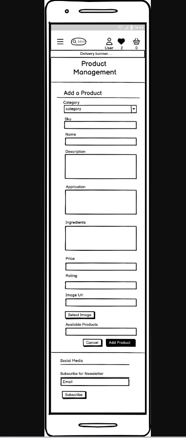
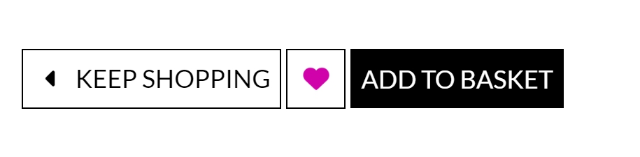
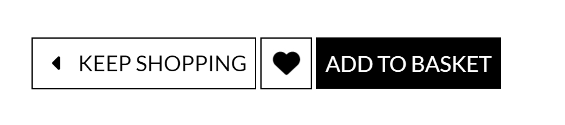

<h1 align = "center">BEAUTY BOUTIQUE</h1><h3 align = "center">YOUR BEAUTY OUR PASSION</h3> 

 

### <h2 align = "center" target = "_blank"> [View The Live Project](https://beauty-boutique-0f4969a43fa4.herokuapp.com/)</h2>   

## OVERVIEW

We at Beauty Boutique believe in quality and are committed to develop a good relationship with our customers. From drugstore and natural cosmetics to premium and luxury, the online shop covers all product segments. The categories perfume, skin care, make-up, hair care, beauty tools and accessories offer a diverse selection of products for daily beauty routines.

To keep the customers uptodate we also offer subscription to our Beauty News in order to receive Newsletters and product updates.

Utilising the Django Full Stack Web Framework, Bootstrap, Stripe API for secure payments, User Experience design and Search Engine Optimisation, the Beauty Boutique Webstore offers its customers an effortless, logical and rewarding user experience.

Users can make online purchases either as a guest or being logged in. Once the payment is successful, the user is sent an email confirmation of their purchase and their order number.

<strong>Note:</strong>
The final website slightly differs from the wireframes that were created in the beginning. The reason being that while i was creating my Readme i found out that the changes would be beneficial for the user experience.

# [Table of Contents](#table-of-contents)
- [Planning and Design](#planning-and-design)

- [Wireframes](#wireframes)
   - [Desktop Wireframes](#desktop-wireframes)
   - [Mobile Wireframes](#mobile-wireframes)
- [User Stories](#user-stories) 
- [Database Schema](#database-schema)

- [Agile](#agile)
- [Features](#features)

- [Existing Features](#existing-features)
   - [Features Across All Pages](#features-across-all-pages) 
      - [The Navbar](#the-navbar) 
      - [The Delivery Banner](#the-delivery-banner)
      - [Footer](#footer) 
   - [Individual Pages](#individual-pages) 
      - [Landing Page](#landing-page)  
      - [Home Page](#home-page)
      - [Products Page](#products-page)
      - [Product Detail Page](#products-detail-page)
      - [My Favourites Page](#my-favourites-page)
      - [Basket Page](#basket-page)
      - [Checkout Page](#checkout-page)
      - [Newsletter Page](#newsletter-page)
      - [Subscribe](#subscribe)
      - [User Account Page](#user-account-page)
      - [Admin Site](#admin-site)
      - [Error Page](#error-page)

- [Testing](#testing)

- [Web Marketing](#web-marketing)
   - [SEO](#seo)
   - [Content Marketing](#content-marketing)

- [Technologies Used](#technologies-used)

- [Deployment](#deployment)

- [Credits](#credits)

- [Acknowledgement](#acknowledgement)

# Planning and Design

- A Complete E-commerce web application will be created
that generates revenue and provides a great user experience. 
- Essential steps include incorporating powerful features and choosing the right platforms, developing a minimum viable product, testing the app, optimizing search engine ranking, and implementing effective marketing strategies to attract and retain customers.

## Wireframes

Balsamic Wireframes were created to visualise what the user will see and to achieve a good UX design. A mobile first approach was used to design the site specifically for mobile use and then the design was changed slightly for desktop view. Below are the Wireframes both for the desktop and the mobile view. 

#### Desktop Wireframes

  

 

  

  

  

  

  

  

  
#### Mobile Wireframes

  

  

  

  

  

  

  

  

  

[Back to Top](#table-of-contents)
### Fonts

Fonts were imported from Google Fonts. The font used for this Project is Lato.

## User Stories

- As a <strong>Site User</strong>, I understand the <strong>Purpose of the Website</strong>  So that I can find what I am looking for and eventually make a purchase. 

- As a <strong>Site User</strong>, after signup or login I can see The <strong>Home Page</strong> so that I can explore the additional features which are allowed to a registered User. 

- As a <strong>Site User</strong> I can easily <strong>Navigate</strong> around the website so that I can explore it and can go on different pages where I want to go. 

- As a <strong>Site User</strong> I can easily navigate to the <strong>Products page</strong> so that I can choose from them and make a purchase. 

- As a <strong>Site User</strong> I can <strong>view Products by selecting Category</strong> so that I can view the products I am searching for without scrolling through all the products. 

- As a <strong>Site User</strong> I can <strong>Sort Products</strong> by Price, Rating or by Category so that I can Easily find what I am looking for. 

- As a <strong>Site User</strong> I can <strong>Search</strong>for a particular product so that I can quickly find the desired product. 

- As a <strong>Site User</strong> I am able to go to a <strong>Product's detail page</strong> so that I can read about the description of the product, add it to favourites or basket by selecting the quantity of the product. 

- As a <strong>Site User</strong> I can <strong>Add or Remove items into the Favourites</strong> so that I can buy them in the Future if they are on sale or simply remove them.

- As a <strong>Site User</strong> I am able to check the <strong>Basket</strong> so that I can find the products I added to it. 

- As a <strong>Customer</strong> I can increase or decrease the <strong>Quantity </strong>of the products so that I can decide how many products I want to buy. 

- As a <strong>Site User</strong> I can <strong>Edit or Update my Basket</strong> so that I can adjust the Quantity of the products or simply remove them before purchasing. 

- As a <strong>Site User</strong> I can <strong>Checkout</strong>securely so that I can see the order summary and purchase the items I have added to the basket. 

- As a <strong>Site User</strong> I can make <strong>Payment</strong> so that I can finally buy the products. 

- As a <strong>Customer</strong> I can receive a <strong>Confirmation Message</strong> after placing an order so that I am satisfied that the order has been placed and can view my order in my order history. 

- As a <strong>New User</strong> I need to understand the <strong>Purpose of Registration</strong>so that I can decide whether I should register an account or not.

- As a <strong>Site User</strong> I can receive an email so that I can <strong>Verify</strong>that my account has been registered successfully. 

- As a <strong>Registered User</strong> I can <strong>Login and Logout</strong> of my account so that I can add products to the Basket, purchase them, add my favourite items to my favourites, see the list of orders I have made or view my details and update them if I need to. 

- As a <strong>Registered User</strong> I can access my <strong>Profile</strong> so that I can view my order history, favourites list and update my delivery details.

- As a <strong>Site User</strong> I can Subscribe for <strong>Newsletter</strong> so that I can get all the updates about new promotions and upcoming sales. 

- As a <strong>Site User</strong>  I can understand when an <strong>Error</strong> occurs so that I can be given clear feedback on what I should do. 

- As an <strong>Admin</strong>  I can login and access the <strong>Admin Site</strong> from the main website so that I can perform the actions required as an Admin.

- As an <strong>Admin</strong> I can <strong>Add, Update or Delete Products</strong> from the website so that I can keep the list of products Up to date and can track all the activity running on my website and can send Newsletters to the Subscribers. 

[Back to Top](#table-of-contents)
## Database Schema

[dbdiagram.io](https://dbdiagram.io/) was used to visualise the custom models for this project. The ER diagram shows the logical relationship between the different entities and makes it clear how the different entities are related to one another.

The Profile model allows users who sign up to have a profile automatically created for them and the user can then update and change their profile information if they wish. One User can have one Profile, hence this is a One-to-One relationship.

Each User can have many Orders, it is representing One-to-Many relationship however each Order can only have one User.

The Categories are linked to the Products Model as a product can only have one category but one category can be assigned to many Products. hence its a one to many relationship.

Each Product can have many Orders, it is also representing One-to-Many relationship.

  

# Agile

In order to use the agile methodology, the github project with linked issues was used. User stories were created and based on these user stories the project was created and brought to life. The link to the kanban board is here:

### [Beauty Boutique Kanban Board](https://github.com/users/ru22-14/projects/6/views/1)   

[Back to Top](#table-of-contents)

# Features

## Existing Features
### Features exist accross all Pages
### Upper Navbar

The navigation bar is visible on the top of the web application across all pages. The name of the beauty store is present on the top left side which takes the user back to Home Page. On the top right corner there are links to Login/Signup and Basket.
 

 Once a user is loggedin there are additional navigation links added to the navigation bar that lead the User to the User Profile and Favourites list. Favourites Icon shows the number of Products added in it and if empty then it displays 0. Like Favourites the Basket icon displays the grand total of the products added in it and if empty then it displays 0 as well. 

 

### Lower Navbar

The User can easily find the navigation links and is able to navigate through the website.
  

### Burger Menu

To enhance the user experience on mobile and tablet devices the nav bar collapses into a burger-style dropdown menu .

  

### The Delivery Banner

The Delivery Banner exists across all the Pages to keep the customer clear about the delivery charges.

  

### Footer

Footer also exists across all the pages. On the left side of the footer the Facebook Page Link is provided and can be accessed by clicking on the link. The link to our Privacy Policy is also provided, the user can read and understand the policy by clicking on it.

While on the right side of the footer the user is given an option to Subscribe to the Newsletters. In this way the Subscriber will receive emails regarding all the upcoming events and updates.

  

### Individual Pages

### Landing Page

The Landing Page contains Logo Name, NavBar, Delivery Banner, Hero image with a button which leads the user to the New Products and an enthusiastic Text with a button under it which leads the user to the Products Page.

It has beautiful contrasts of Pink Colour.

The Icons on the right side of the Top Navbar will change the colour after login.

  

### Home Page

The Home Page is the  same as Landing Page except that after logging in the icons on the right side of the top Navbar Increases as the favourites icon also appears and all the icons change their colour and text as per user's activity. The user can read our Business objective and the information about the online store. In the footer section the user can find the facebook page, access our privacy policy as well as subscribe for the newsletters.

 

  
   
### Products Page

The Products Page features a sort selector at the top left of the page with a toggle switch that can sort products based on Alphabetical order, Category, Name or Price. The User can view all the Products or  Products under different Categories by clicking the links provided in the navbar. 

### All Products

The Products Page Contains Product Cards that have an image of the product and beneath the image is the name of the product, price, category name. 

In case the User is the Owner(admin) of the Webstore then two more links will be provided at the bottom of each card so the Owner(admin) can edit a Product or simply delete it.  

  

### Care 
#### Skin Care Products Page
  

#### Body Care Products Page
  

#### Hair Care Products Page
  

### Makeup 

#### Complexion Products Page
  

#### Eyeshadow Products Page
  

#### Lipstick Products Page
  

### Perfumes

#### Scents Page
  

#### Attar Page
  

### Special Offers
#### New Arrivals Page
  

#### Products on Sale Page
  

### Product Detail Page

The Product Detail Page contains brief information about the product as well as its price, description, application, ingredients and stock status.

The Customer can select the quantity of the product , increase or decrease it by clicking on the plus and minus buttons and then can add it into the Basket.

  

The Customer can also add a product to favourites by clicking on the heart icon and can buy it later. The favourites icon on the detail page  changes its colour from black to pink and the customer is informed through a message that the product is added to favourites.

 

  

The Favourites icon on the top navbar displays the number of products added to favourites.
  

The Customer can remove the Product from favourites simply by clicking again on the icon given on the Product detail page.

  

The Customer will be notified that the Product is removed from the favourites list.

  

Next to the favourites icon there is an add to Basket button. After selecting the quantity the Customer can click on the button and the product will be added to the basket. A small notification window regarding the information about order detail will appear. Customers can also directly access the basket from the message container. If the grand total is less then the amount of 30$ the user will be notified through this message. 

  

  

The Basket icon on upper navbar will display the grand total to the customer.

  

### My Favourites Page

Whenever a registered user adds a product to their favourites, they are informed by an info message. A user´s favourites, and the products added to it are saved for the user´s convenience even if they logout or refresh their browser.

The favourites page includes the product´s image and 'Add to Basket' and 'Remove From Favourites' buttons. The Add to Basket feature is designed to maximise convenience for user. Adding a product to the basket from the favourites does not remove it from the favourites. In this way the user has no need to search for the product everytime. 

  

If the favourites list is empty the user will see a message and a link to the Products Page. 

  

When the favourites list is empty the Favourites icon on the Upper navbar will also display 0 as there are no products added to favourites.

  

### Basket Page

The basket items section contains product cards each displaying an image, name, price and quantity of each basket item. Every product card has its own selector and update button which allow the users to modify their basket without having to return to the products page. There is also a feature that allows the user to remove the entire quantity of an item from the basket if they desire.

In order to make a purchase there is a button provided which leads the user to the checkout form else the user can continue shopping by clicking the keep shopping button. 

 
   

After adjusting the quantity the user is informed through a success message. and the basket icon in upper navbar updates the amount accordingly.

 
 

  

In case the user's basket is empty it will clearly display a message and a link towards the products page.

  

### Checkout Page

The Checkout page has an order summary that provides the total cost information from the basket page.

If the user is a new user then he/she has to fill the form with correct data otherwise the delivery information is prepopulated in the form if a user has it saved to their profile. The option for registered users to save their information to their profile is provided if they have not already done so.

The payment details section is taken directly from Stripe to capture the payment card information. As the Stripe payment system is not fully activated only the test card information can currently be utilised.

One can use this card detail to make a fake purchase.

  

A stripe developer account was created at [Stripe](https://stripe.com/en-gb-de) to give access to the api keys required to run the payment processes. Stripe documentation was followed to impliment Stripe as the payment platform.

    

At the bottom of the checkout form there are two options for the customer if they want to checkout or adjust their basket.

After a successfull checkout the user is notified and leads to another page which displays information that a confirmation is sent to the user's Email along with a brief Order Summary. A link to the new arrivals page is also provided under the order summary.

  

### My Profile Page

Inside My Profile the users can find the Order History and can find all the orders placed.
There the user is also provided a form in order to update the address in case they need to do so.

  

### Newsletter Page

This page is accessable only to the owner(admin) of this website. The owner(admin) can send Newsletters regarding updates, special offers and any upcoming events to all the Subscribers.

  

A success message appears after sending a newsletter email to the subscribers.

  

  

### Subscribe

Users can subscribe for newsletters in order to keep themselves updated with the events.

  

After subscribing successfully the user is informed through a message.

  

One Email address can be subscribed only once otherwise an error message displays if a user tries to subscribe the same email address again. 
  

### User Account Page

Users are allowed to sign up for an account if they can provide a valid, verifiable, Email address.

Once registered, users can log in and out of the site to enjoy extra features and benefits, such as access to favourites and the ability to store delivery information to their user profile and to update it.

Everytime a user login or logout a notification message appears.

  

  

  

  

### Admin Site

A super user was created to allow access to the admin panel of the website. Once logged in as an admin, the Admin Site link is accessable on the top navigation bar by clicking on the account icon.

### Product Management

 
 

Once signed in as an Admin, a link in the upper navigation bar under the accounts section. This link takes the Admin to a form where they can add new products. There is the option to choose an image as well.

On the Product Detail Page Edit or Delete buttons are also visible only for an Admin User. Admin can update any information related to a product by clicking the edit button or can simply delete it.

Admin can verify an Email address, can view or delete orders, confirm or delete the subscribers request and can perform other tasks as per requirement.

  

  

  

  

  

### Error Page

Custom Error Page was created to make it convenient for the user and ensure an appropriate link back to the main site to guide users who come across these messages.

  

[Back to Top](#table-of-contents)
## Features to be Implemented

In the future i want to implement an out of stock functionality which will inform the customer if a product is out of stock. I tried to implement it in this Project. At the moment it works only for a product which is in stock but the out of stock functionality is partially implemented.

# Testing

The testing documentation is provided in [TESTING.md](TESTING.md)
# Web Marketing

The purpose of this site is a B2C relationship and it's main goal is to provide the oppurtunity to those Women especially who have busy schedules and do not have enough time to go store to store to buy beauty products. Web marketing is the process of marketing, and it's a cost-effective way to reach people who are interested.

## SEO

The detailed Search Engine Optimisation strategies used for this project for Web Marketing are here:

- An xml sitemap was created and added to the project's root directory. This is a file that lists the website’s important page URLs, making sure that search engines can crawl, or navigate, through them. It also helps search engines understand the website structure, so can help speed up content discovery.

- Then the robots.txt file was created and added to the projects root directory as well. This is a simple text file that tells search engines where they are not allowed to go on the website. It lists out any folders or files that will not be crawled or indexed by search engine spiders. Having this robots.txt file shows that the site acknowledges that search engines are allowed and that they may have free access to it. For this reason, search engines take the existence of this file as a sign of quality, and so should improve the SEO ranking.

- The final step for working with a sitemap and robots files can only be implemented for web applications that have a DNS certificate. As this website is for learning purpose only so no further action is taken.

Keywords determined which were most important to the sites potential customers. Keyword research is the process of finding and analyzing search terms that people mostly enter into search engines, with the goal of using that data for SEO or general web marketing. Content Stuffing is also avoided and keywords were only utilised if they fit within the flow of the content for better SEO.

## Content Marketing

Content marketing refers to the strategic planning, creation and distribution of content to reach a pre-defined audience. In contrast to classic marketing approaches, content marketing  does not focus on the products, but rather on the potential customers and their concerns.

Beauty Boutique gives the users the option to subscribe to the newsletter.  Newsletters are sent to attract new customers and also keep the existing customers up to date with special offers. One disadvantage to this could be that the newsletter will be seen as spam and not reach the user.

Social media marketing is also chosen for this project because it's free. The link of our Facebook Page is here:  
[Beauty Boutique Facebook Page](https://www.facebook.com/profile.php?id=61552478260348)

   

[Back to Top](#table-of-contents)
# Technologies Used

### Languages

-  [HTML5](https://en.wikipedia.org/wiki/HTML5)
-  [CSS3](https://en.wikipedia.org/wiki/Cascading_Style_Sheets)
-  [Python](https://www.python.org/)
-  [Java Script:](https://de.wikipedia.org/wiki/JavaScript)
### Frameworks & Liabraries

- [Django](https://de.wikipedia.org/wiki/Django_(Framework)): Python framework used to develop Beauty Boutique
- [django allauth](https://pypi.org/project/django-allauth/): Authentication library used to create the user accounts
- [Bootstrap](https://getbootstrap.com/): CSS Framework for developing responsiveness and mobile-first 
- [Font Awesome:](https://fontawesome.com/) was used to add icons and for UX purposes.
- [Heroku:](https://heroku.com/login) is used to deploy the project. 
- [Stripe API](https://stripe.com/). Used Stripe to manage secure payments

### Database 

- SQLite: was used as the database during development
- ElephantSQL: was implemented as the Postgres, database management system.

### Software

- [Git](https://git-scm.com/) : is a version control system 
- [Github](https://github.com/) : to build a Project and keep track of the progress.
- [Gitpod](https://www.gitpod.io/) :  a cloud development environment is used to efficiently and securely develop this application.
- [Heroku](https://www.heroku.com/) : to deploy, manage, and scale apps.
- [Stripe](https://stripe.com/) : to accept payments online
- [Google mail](https://mail.google.com/) : os secure, smart and easy-to-use email solution 
- [AWS](https://aws.amazon.com/) : hosting server for static files and images
- [Balsamiq](https://balsamiq.cloud/): used to create the wireframes for design
- [DB Diagram](https://dbdiagram.io/): used to create the entity relationship diagram between models.
- [Crispy Forms](https://django-crispy-forms.readthedocs.io/en/latest/install.html) : let you control the behavior of form in a very elegent way.
- [psycopg2](https://pypi.org/project/psycopg2/) :  Python-PostgreSQL Database Adapter
- [Unsplash](https://unsplash.com/) : is used to get the  beautiful, free images and photos for this project.
- [Skitch](https://www.chip.de/downloads/Skitch-fuer-Windows_58173678.html) : is used to take screenshots for Readme   

[Back to Top](#table-of-contents)
# Deployment

The detailed instructions on how to clone this project repository and the steps to configure and deploy the application are given below.  Code Institute provides a summary of deployment process steps here : [CI Cheat Sheet](https://codeinstitute.s3.amazonaws.com/fst/Django%20Blog%20Cheat%20Sheet%20v1.pdf) and in the walkthrough project as well.

1. Create Application and Postgres DB on Heroku
2. Connect the Heroku app to the GitHub repository
3. Configure AWS to Host the static files and images
4. Google Mail account
5. Stripe
6. Final Deployment steps
7. How to Clone the Repository
8. How to Fork the Repository

## Create Application and Postgres DB on Heroku
- Log in to Heroku at https://heroku.com - create an account if needed.
- From the Heroku dashboard, click the Create new app button.  For a new account an icon will be visible on screen to allow you to Create an app, otherwise a link to this function is located under the New dropdown menu at the top right of the screen.
- On the Create New App page, enter a unique name for the application and select region.  Then click Create app.
- On the Application Configuration page for the new app, click on the Resources tab.
- In the Add-ons search bar enter "Postgres" and select "Heroku Postgres" from the list - click the "Submit Order Form" button on the pop-up dialog.
- Next, click on Settings on the Application Configuration page and click on the "Reveal Config Vars" button - check the DATABASE_URL has been automatically set up. 
- Add a new Config Var called "DISABLE_COLLECTSTATIC" and assign it a value of 1.
- Add a new Config Var called SECRET_KEY and assign it a value - any random string of letters, digits and symbols.
- The settings.py file should be updated to use the DATABASE_URL and SECRET_KEY environment variable values.

- In Gitpod, in the project terminal window, to initialize the data model in the postgres database, run the command : python3 manage.py migrate 
- Make sure the project requirements.txt file is up to date with all necessary supporting files by entering the command : pip3 freeze --local > requirements.txt
- Commit and push any local changes to GitHub.
- In order to be able to run the application on localhost, add SECRECT_KEY and DATABASE_URL and their values to 
env.py

### Connect the Heroku app to the GitHub repository
- Go to the Application Configuration page for the application on Heroku and click on the Deploy tab.
- Select GitHub as the Deployment Method and if prompted, confirm that you want to connect to GitHub. Enter the name of the github repository and click on Connect to link up the Heroku app to the GitHub repository code.
- Scroll down the page and choose to either Automatically Deploy each time changes are pushed to GitHub, or Manually deploy - for this project Manual Deploy was selected.
- The application can be run from the Application Configuration page by clicking on the Open App button.
### Configure AWS to host images used by the application

- Create an Account on aws.amazon.com
- Once your account is created you can go back to aws.amazon.com and sign-in in the upper right by accessing the AWS management console under my account.
- Search for S3 and create a bucketby following the Walkthrough project. Name the bucket same as your project name.
- First on the properties tab turn on static website hosting.
Which will give a new endpoint to access it from the internet.
- On the permissions tab make three changes
  1. First paste in a coors configuration
which is going to set up the required access between Heroku app and this s3 bucket.
  2. Next  go to the bucket policy tab.
and select policy generator which creates a security policy for this bucket.
(The policy type is going to be s3 bucket policy.
Will allow all principals by using a star and the action will be get object.
Copy the ARN which stands for Amazon resource name from the other tab and paste it into the ARN box here at the bottom. click Add statement. )
  3. Generate policy Ccopy this policy into the bucket policy editor.Before clicking Save dd a slash star here onto the end of the resource key(because we want to allow access to all resources in this bucket ). Click save.
- The last thing we need to do to configure it is to go to the access control list tab, click edit and enable List for Everyone (public access) and accept the warning box. If the edit button is disabled, you need to change the Object Ownership to ACLs enabled.
- Now we need to create a user to access it. Do this through another service called Iam which stands for Identity and Access Management. Let's go back to the services menu and open Iam. The process here is first we're going to create a group for our user to live in.
Then create an access policy giving the group access to the s3 bucket we created, and finally, assign the user to the group so it can use the policy to access all our files. (Download and save the Policy as Because gone through this process The Ploicy can't be downloaded again).
- install two new packages in django and freeze them in requirements.txt file.
  1. boto3
  2. django-storages
- Add storages in Settings.py inside Installed Apps.
- Define AWS_STORAGE_BUCKET_NAME, The AWS_S3_REGION_NAME
And our access key, and secret access key from the environment.
- Log in to Heroku and go to the Application Configuration page for the application.  Click on Settings and click on the "Reveal Config Vars" button.
- Add  new Config Vars called AWS_ACCESS_KEY_ID, AWS_SECRET_ACCESS_KEY, AWS_USE and assign it the value copied from the AWS dashboard. 
- Remove the disable collectstatic variable.
- In production to use s3 to store our static files  create a file called custom storages.Inside this file, Import Settings and create two classes for location functionality.
- The last step then is to go to Settings.py
tell it that for static file storage we want to use our storage class and that the location it should save static files is a folder called static and then do the same thing for media
- We also need to override and explicitly set the URLs for static and media files using our custom domain and the new locations.
- Push the code to Heroku and enable automatic deployments on Heroku.
- Deploy to Heroku 
- Go to S3 and create a new folder Media. Upload all images there

### Google Mail

- Create a google email account with a name relevant to you project. After you login, navigate to accounts settings, then click on Other Google Account Settings

- Navigate to accounts then import and click on other account settings

- In the signing into Google section, activate 2-step verification.

- Once verified click on app passwords, select Other as the app and give the password a name, for example Django

- Click create and a 16 digit password will be generated, copy this 16 digit password

- Add the Email settings to the settings.py file by following the Walkthrough.

- Add EMAIL_HOST_PASS and EMAIL_HOST_USER variable, password and email address to your Heroku Config Vars.

### Stripe

- Create a Stripe Account

- Log in and click on 'Developers

- Navigate to API keys

- Copy the the publishable and secret key

- Add the Environ Variables in Settings.py

- Back in the Developers section on Stripe, navigate to webhooks and click create endpoint.

- Create a webhook for all events in Stripe and save the key

- Add the webhook key to your environment variables and test using the Stripe events log.

### Final Deployment steps
Once code changes have been completed and tested on localhost, the application can be prepared for Heroku deployment as follows :
- Set DEBUG flag to False in settings.py
- Ensure requirements.txt is up to date using the command : pip3 freeze --local > requirements.txt
- Push files to GitHub
- In the Heroku Config Vars for the application delete this environment variable :  DISABLE_COLLECTSTATIC
- On the Heroku dashboard go to the Deploy tab for the application and click on deploy branch

#### The live link to the application can be found here - [Beauty Boutique](https://beauty-boutique-0f4969a43fa4.herokuapp.com/)

### How to Clone the Repository 

- Go to the https://github.com/ru22-14/beauty-boutique repository on GitHub 
- Click the "Code" button to the right of the screen, click HTTPs and copy the link there
- Open a GitBash terminal and navigate to the directory where you want to locate the clone
- On the command line, type "git clone" then paste in the copied url and press the Enter key to begin the clone process
- To install the packages required by the application use the command : pip install -r requirements.txt
- When developing and running the application locally set DEBUG=True in the settings.py file
- Changes made to the local clone can be pushed back to the repository using the following commands :

  - git add *filenames*  (or "." to add all changed files)
  - git commit -m *"text message describing changes"*
  - git push

- N.B. Any changes pushed to the main branch will take effect on the live project once the application is re-deployed from Heroku.

### How to Fork the Repository 

A fork is a new repository that uses the same code and visibility settings as the repository. Forking a repository allows you to experiment/propose changes without even affecting the original project.

To fork this project, 
  1. Go to the top left of the repository, where you see the Fork Icon.
  2. click Fork. 

This will create a copy of the repository for you.

[Back to Top](#table-of-contents)
# Credits
### Boutique Ado
This project is build with the help of the Code Institute's "Boutique Ado" Walk-through Project.

### Favourites App  
To create Favourites app i took help from here:  
[Stackoverflow](https://stackoverflow.com/questions/67493992/django-add-products-to-favorite-list?rq=3)

### Newsletter App

To create Newsletter app i took help from here :  
[Twilio.com](https://www.twilio.com/blog/build-email-newsletter-django-twilio-sendgrid)  
[Django](https://docs.djangoproject.com/en/4.2/topics/email/) 
[Pylessons](https://pylessons.com/django-subscribe/)

### Timeout

To set the timeout functionality on toast messages, I took help from here:  
[Stackoverflow](https://stackoverflow.com/questions/316278/timeout-jquery-effects)

### Hide/ Show

On the Product Detail page the help to implement the functionality of show and hide the product detail is taken from here:  
[Stackoverflow](https://stackoverflow.com/questions/20735726/show-more-less-text-with-just-html-and-javascript)

### Back to Top

To Create Back to top functionality on README file, I took help from here:   
[Github](https://github.com/orgs/community/discussions/42712#section-1)

# Acknowledgement
I would like to acknowledge my heartfelt gratitude to my family members for all their help, support and patience during the period of this course. 

Finally, i would like to thank Code Institute for providing students with a tremendous oppurtunity to change their life by teaching them outstanding skills in a short period of time. 

Special thanks to all those active members in the slack community who got me out of problems where i was stuck and could not find a solution. 

[Back to Top](#table-of-contents)

