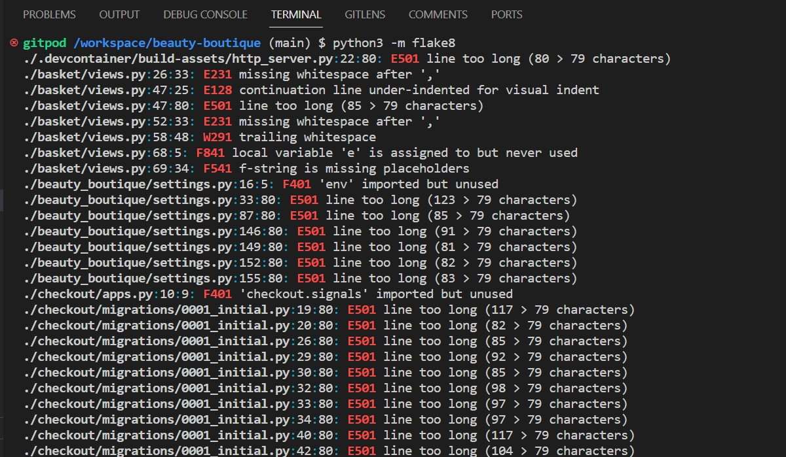
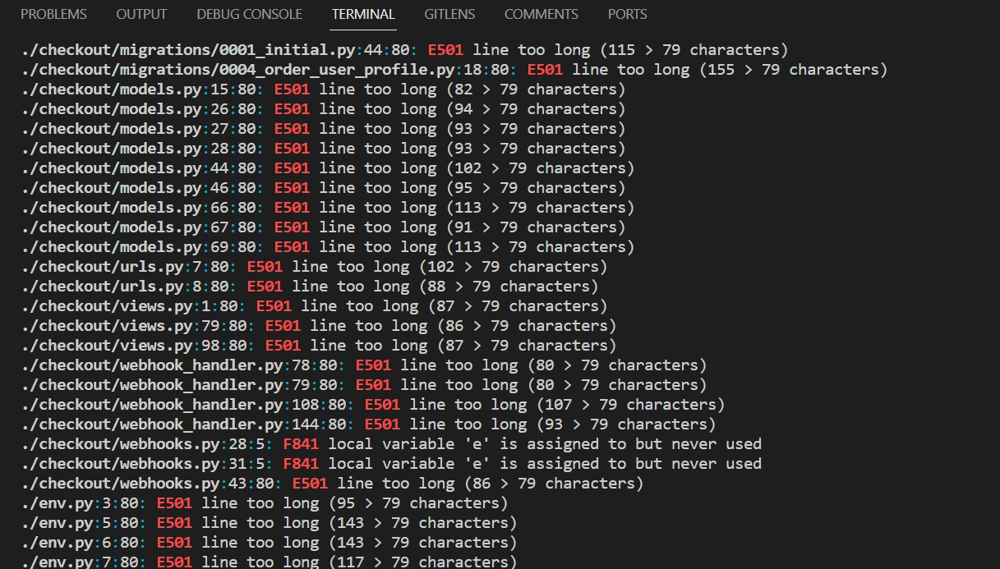
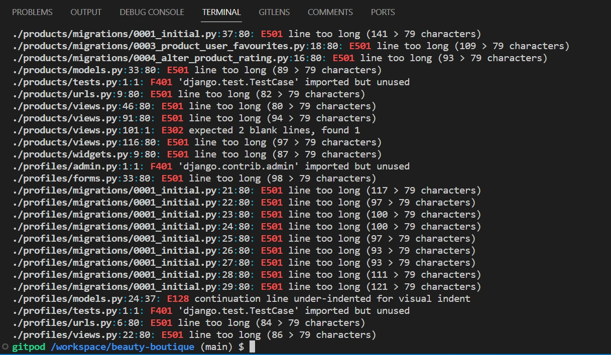

return to [README.md](README.md)
# Index - Table of Contents

- [Manual Testing](#manual-testing)
- [Validation Tests](#validation-tests)
- [Bugs](#bugs) 

# Manual Testing

These tests are based on User Stories, Links and Features testing.

### Purpose of The Website /Landing Page

### US.01: 

#### Acceptance Criteria

#### Steps taken to Test Manually

### Home Page 

### US.22: 

#### Acceptance Criteria

#### Steps taken to Test Manually

### Navigation

### US.02: 

#### Acceptance Criteria

#### Steps taken to Test Manually

### View Products 

### US.03: 

#### Acceptance Criteria

#### Steps taken to Test Manually

### View Products By Category

### US.04: 

#### Acceptance Criteria

#### Steps taken to Test Manually

### Search Products

### US.05: 

#### Acceptance Criteria

#### Steps taken to Test Manually

### Product Sorting

### US.21: 

#### Acceptance Criteria

#### Steps taken to Test Manually

### Product Detail

### US.23: 

#### Acceptance Criteria

#### Steps taken to Test Manually

### Favourites

### US.06: 

#### Acceptance Criteria

#### Steps taken to Test Manually

### Basket

### US.07: 

#### Acceptance Criteria

#### Steps taken to Test Manually

### Quantity of Products

### US.15: 

#### Acceptance Criteria

#### Steps taken to Test Manually

### Edit or Update Basket

### US.08: 

#### Acceptance Criteria

#### Steps taken to Test Manually

### Checkout

### US.09: 

#### Acceptance Criteria

#### Steps taken to Test Manually

### Payment

### US.10: 

#### Acceptance Criteria

#### Steps taken to Test Manually

### Order Confirmation

### US.17: 

#### Acceptance Criteria

#### Steps taken to Test Manually

### Register an Account

### US.11: 

#### Acceptance Criteria

#### Steps taken to Test Manually

### Verification

### US.12: 

#### Acceptance Criteria

#### Steps taken to Test Manually

### Login/Logout

### US.13: 

#### Acceptance Criteria

#### Steps taken to Test Manually

### View/ Update User Profile

### US.14: 

#### Acceptance Criteria

#### Steps taken to Test Manually

### Subscribe to Newsletter

### US.16: 

#### Acceptance Criteria

#### Steps taken to Test Manually

### Error Page

### US.18: 

#### Acceptance Criteria

#### Steps taken to Test Manually

### Admin

### US.19: 

#### Acceptance Criteria

#### Steps taken to Test Manually

### Admin Objectives

### US.20: 

#### Acceptance Criteria

#### Steps taken to Test Manually

# Validation Test

#### HTML is checked through the W3C CSS Validator and shows no errors.

  

#### CSS is checked through the W3C CSS Validator and shows no errors.

  

#### JavaScript is checked through the JSHint and shows no errors.

  

#### Python code is validated using the command "python3 -m flake8" from the Gitpod terminal. Most of the errors are line too long or other Django errors. The code is free of any warnings. I tried to remove all the Errors but still there are some left.

  

  

  

# Bugs

There are no Bugs found.

